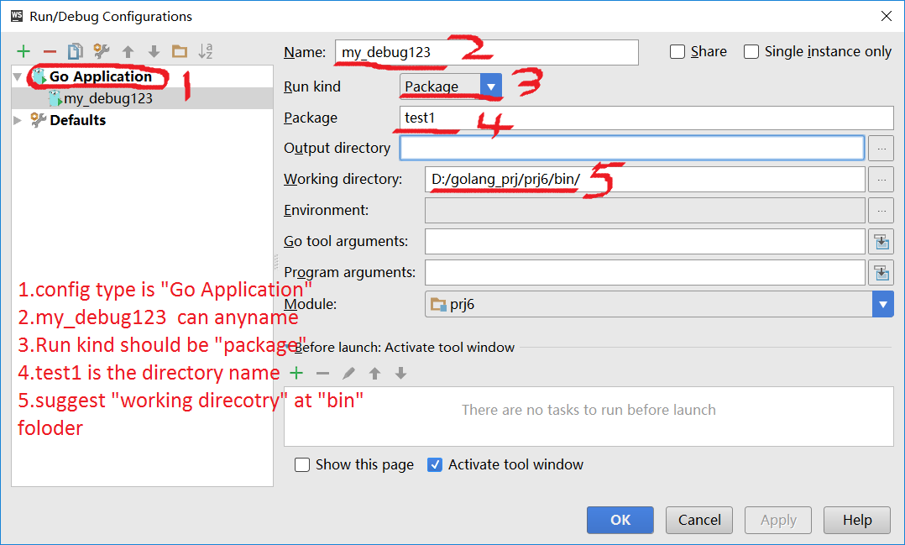

intellij idea build multi file and debug,  my project at D:\golang_prj\prj6 , addto "GOPATH"

here is this project files:

	├─prj6
	│  │
	│  ├─bin
	│  │      home.html
	│  │
	│  ├─pkg
	│  └─src
	│      └─test1
	│              client.go
	│              hub.go
	│              main.go
	

main.go, hub.go, client.go: the three file all in package main; open intellij idea, click "Import Project", input path: "D:\golang_prj\prj6\src"

and setting as:

