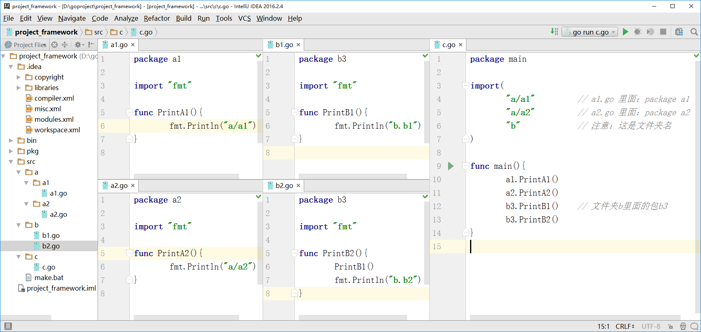
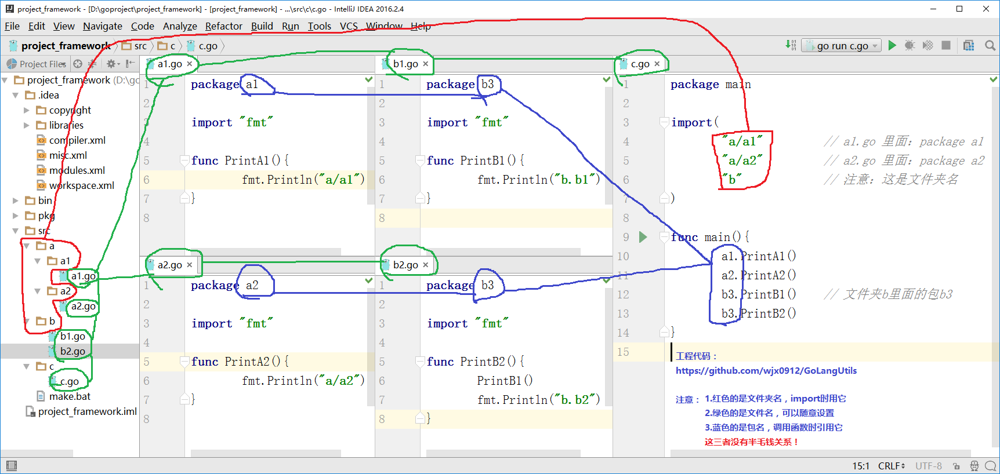

参考：[http://www.cnblogs.com/zolo/p/5849110.html](http://www.cnblogs.com/zolo/p/5849110.html "http://www.cnblogs.com/zolo/p/5849110.html")

添加内容：

	(1)如果文件名以_test.go结尾，那里面的package名没有限制
	(2)xxx

下面两张图说明问题：

